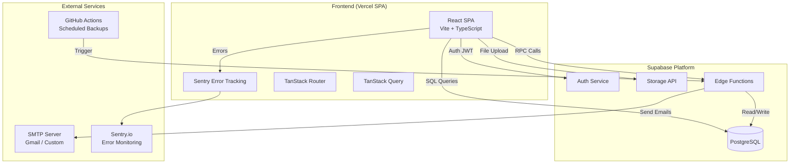
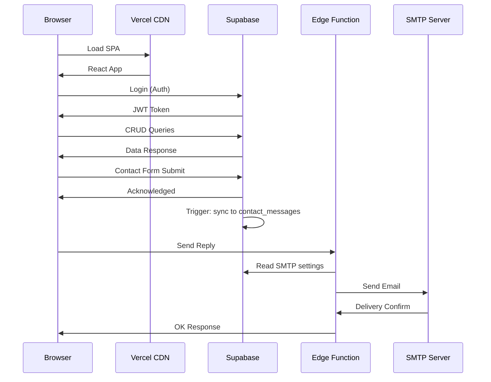
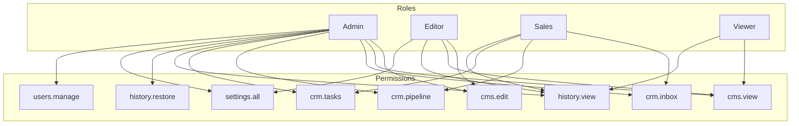

# AION Flow — Architecture Diagram

## System Overview

## Module Architecture

```mermaid
graph LR
    subgraph CMS["Content Management"]
        S[Services]
        B[Blog]
        P[Products]
        PG2[Pages]
        M[Media]
    end

    subgraph CRM["Customer Relations"]
        IN[Inbox]
        TH[Threading]
        AT[Attachments]
        SR[Search]
    end

    subgraph Sales["Sales Pipeline"]
        PL[Pipeline]
        FUP[Follow-Up Tasks]
        LV[Lead Values]
    end

    subgraph Platform["Platform"]
        HI[History / Audit]
        RL[Roles & Permissions]
        BK[Backups]
        OB[Observability]
    end

    CMS --- CRM --- Sales --- Platform
```

## Data Flow

## Permission Model

## Tech Stack

| Layer | Technology |
|-------|-----------|
| Framework | React 19 + TypeScript |
| Bundler | Vite 7 |
| Routing | TanStack Router |
| Styling | Tailwind CSS 4 |
| Backend | Supabase (PostgreSQL + Auth + Storage + Edge Functions) |
| Hosting | Vercel (SPA) + Supabase (DB/API) |
| Email | SMTP via nodemailer (Edge Functions) |
| Monitoring | Sentry (errors) + Custom Observability Dashboard |
| Scheduling | GitHub Actions (daily/weekly backups) |
