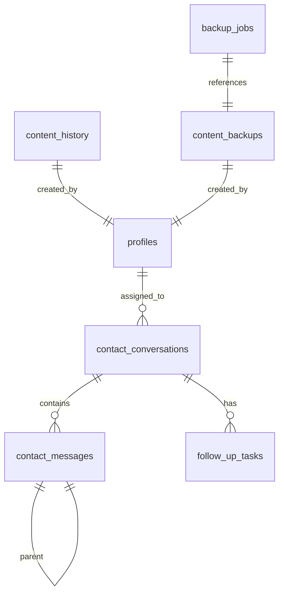

# AION Flow — Database Schema

## Entity Relationship

---

## Table: `profiles`

User accounts with roles and preferences.

| Column | Type | Default | Description |
|--------|------|---------|-------------|
| id | uuid PK | gen_random_uuid() | Primary key, references auth.users |
| email | text UNIQUE | | User email |
| full_name | text | `''` | Display name |
| avatar_url | text | `''` | Profile image URL |
| role | text | `'admin'` | `admin` / `editor` / `sales` / `viewer` |
| timezone | text | `'Europe/Athens'` | IANA timezone |
| locale | text | `'el'` | Language code |
| is_active | boolean | true | Account active status |
| last_login_at | timestamptz | | Last sign-in timestamp |

**RLS:** Authenticated users can read/write own profile. Admin role checked via JWT.

---

## Table: `contact_conversations`

Thread grouping per unique email sender.

| Column | Type | Default | Description |
|--------|------|---------|-------------|
| id | uuid PK | gen_random_uuid() | |
| email | text NOT NULL | | Contact email (lowercased) |
| name | text | `''` | Contact name |
| phone | text | `''` | Contact phone |
| status | text | `'active'` | `active` / `closed` / `archived` / `spam` |
| lead_stage | text | `'new'` | `new` / `contacted` / `proposal` / `won` / `lost` |
| lead_value | numeric(10,2) | 0 | Pipeline monetary value |
| won_at | timestamptz | | When lead was won |
| last_message_at | timestamptz | now() | Last activity timestamp |
| assigned_to | uuid FK→profiles | | Admin assigned to this lead |

**Indexes:** `email`, `status`, `last_message_at DESC`, `lead_stage`

---

## Table: `contact_messages`

Individual messages in conversations (incoming + outgoing).

| Column | Type | Default | Description |
|--------|------|---------|-------------|
| id | uuid PK | gen_random_uuid() | |
| conversation_id | uuid FK→conv | NOT NULL | Parent conversation |
| name | text NOT NULL | | Sender/recipient name |
| email | text NOT NULL | | Sender/recipient email |
| phone | text | `''` | |
| subject | text | `''` | Email subject line |
| message | text NOT NULL | | Message body |
| direction | text | `'incoming'` | `incoming` / `outgoing` |
| status | text | `'new'` | `new` / `read` / `replied` / `archived` |
| parent_id | uuid FK→self | | Parent message for threading |
| attachments | jsonb | `'[]'` | `[{name, url, size, mime_type}]` |
| last_message_at | timestamptz | now() | |
| search_vector | tsvector | GENERATED | Full-text search (Greek + English) |

**Indexes:** `conversation_id`, `created_at DESC`, `status`, `direction`, `search_vector` (GIN)

---

## Table: `follow_up_tasks`

Action items linked to conversations.

| Column | Type | Default | Description |
|--------|------|---------|-------------|
| id | uuid PK | gen_random_uuid() | |
| conversation_id | uuid FK→conv | NOT NULL | Parent lead |
| title | text NOT NULL | | Task description |
| completed | boolean | false | Completion status |
| due_at | timestamptz | | Optional due date |

**Indexes:** `conversation_id`, `due_at WHERE NOT completed`

---

## Table: `content_history`

Audit log for all CMS/CRM entity changes.

| Column | Type | Default | Description |
|--------|------|---------|-------------|
| id | uuid PK | gen_random_uuid() | |
| tenant_id | uuid | | Multi-tenant support |
| table_name | text | | Affected table |
| record_id | text | | Affected record ID |
| entity_name | text | | Human-readable name |
| operation | text | | `create` / `update` / `delete` / `restore` |
| changed_fields | text[] | | List of changed columns |
| snapshot_before | jsonb | | State before change |
| snapshot_after | jsonb | | State after change |
| summary | text | | Human-readable description |
| user_id | text | | Who performed the action |
| expired_at | timestamptz | | Auto-cleanup timestamp |

**Indexes:** `created_at DESC`, `table_name`, `operation`

---

## Table: `content_backups`

Full system snapshots.

| Column | Type | Default | Description |
|--------|------|---------|-------------|
| id | uuid PK | gen_random_uuid() | |
| tenant_id | uuid | | Tenant reference |
| name | text | | e.g. "Daily Backup 2026-06-10" |
| snapshot | jsonb | | Full data dump of all tables |
| snapshot_version | int | 1 | Version for migration tracking |
| size_bytes | bigint | 0 | Serialized size |
| user_id | text | | Triggered by |

---

## Table: `backup_jobs`

Backup execution tracking.

| Column | Type | Default | Description |
|--------|------|---------|-------------|
| id | uuid PK | gen_random_uuid() | |
| type | text NOT NULL | | `manual` / `daily` / `weekly` |
| status | text | `'running'` | `running` / `success` / `failed` |
| backup_id | uuid FK→backups | | Resulting backup |
| size_bytes | bigint | 0 | Backup size |
| error_message | text | | Failure reason |
| started_at | timestamptz | now() | |
| completed_at | timestamptz | | |

**Indexes:** `type`, `status`, `created_at DESC`

---

## Table: `contact_submissions`

Legacy table. Used by public contact form for direct inserts. Syncs to `contact_messages` via trigger.

| Column | Type | Default |
|--------|------|---------|
| id | uuid PK | gen_random_uuid() |
| name | text NOT NULL | |
| email | text NOT NULL | |
| phone | text | `''` |
| message | text NOT NULL | |
| read | boolean | false |
| created_at | timestamptz | now() |

---

## RLS Policies Summary

| Table | Action | Role | Policy |
|-------|--------|------|--------|
| profiles | SELECT | authenticated | Own profile only |
| profiles | UPDATE | authenticated | Own profile only |
| contact_conversations | ALL | authenticated | Full access |
| contact_messages | ALL | authenticated | Full access |
| follow_up_tasks | ALL | authenticated | Full access |
| content_history | SELECT | authenticated | Full access |
| content_backups | SELECT/INSERT | authenticated | Full access |
| backup_jobs | ALL | authenticated | Full access |
| contact_submissions | INSERT | anon | Anyone can submit |
| contact_submissions | SELECT/UPDATE/DELETE | authenticated | Admin access |
| storage.objects | INSERT | authenticated | `contact-attachments` bucket |
| storage.objects | SELECT | anon, authenticated | Public read |
